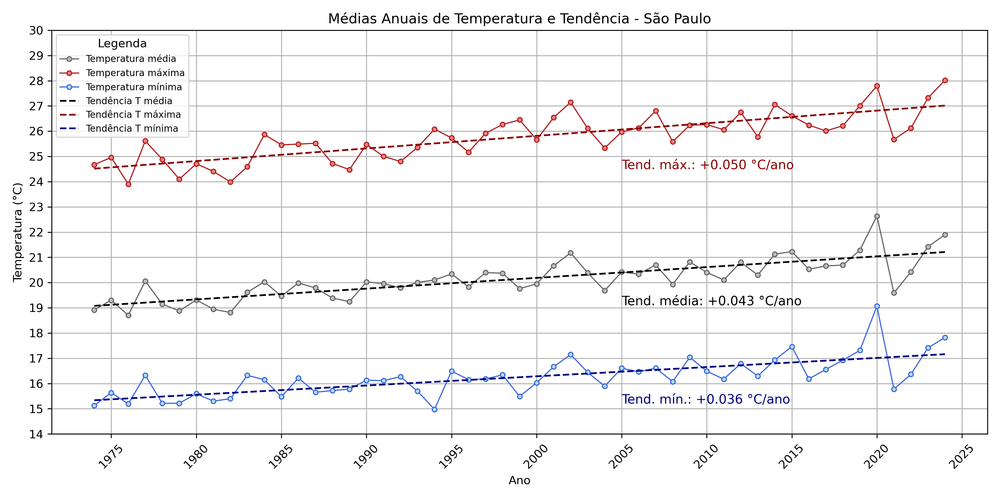
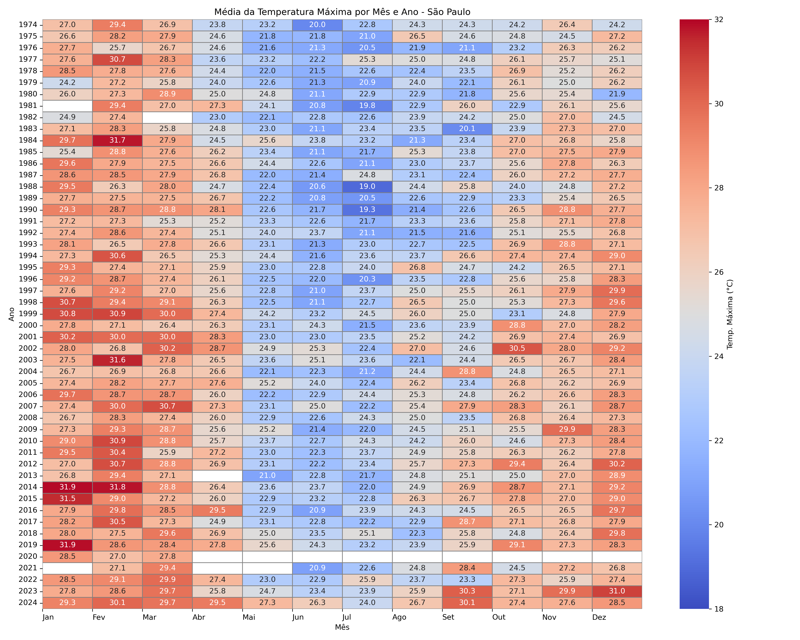
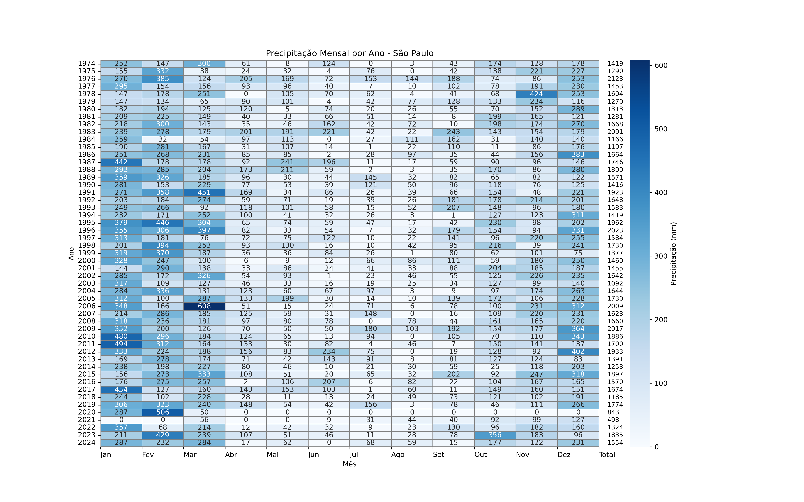

# 🌨🌤️ Análise de Temperaturas e Precipitação em São Paulo (1974–2024) 🌡🌧

Este projeto faz parte do meu portfólio de análise de dados e tem como objetivo explorar dados meteorológicos da cidade de São Paulo ao longo dos últimos 50 anos, com foco em **temperatura** e **precipitação**.

---

## 📌 Objetivos

- Analisar a variação anual das temperaturas mínima, média e máxima.
- Visualizar tendências de aquecimento ou resfriamento por meio de regressão linear.
- Explorar padrões mensais com **heatmaps**.
- Avaliar a distribuição e intensidade das chuvas ao longo das décadas.

---

## 🗂️ Estrutura do Projeto

- `data/`: dados utilizados no projeto
- `notebooks/`: notebooks com a análise exploratória
- `visuals/`: imagens e gráficos gerados
  - `graphs/`: gráficos exportados
- `README.md`: documentação geral do projeto
- `requirements.txt`: lista de bibliotecas Python necessárias

---

## 🛠️ Tecnologias e Bibliotecas

- Python 3.x  
- Pandas  
- Seaborn  
- Matplotlib  
- NumPy
- Scipy

---

## 📊 Exemplos de Visualizações

### Temperatura Média Anual

### Heatmap: Temperatura Máxima por Mês e Ano  

### Heatmap: Precipitação Mensal  

---

## 📈 Principais Resultados

- Tendência de aumento nas temperaturas mínimas e médias desde os anos 70.
- Variação sazonal clara nas temperaturas.
- Mudança nos padrões de precipitação ao longo dos anos.

---

## 🔍 Fontes dos Dados

- Instituto Nacional de Meteorologia (INMET) - [https://bdmep.inmet.gov.br/](https://bdmep.inmet.gov.br/)

---

## 💡 Próximos Passos

- Análise de extremos climáticos (ondas de calor e frio).
- Correlação entre temperatura e precipitação.
- Comparação com outras capitais brasileiras.

---

## 📬 Contato

Caso tenha interesse em conversar sobre este projeto ou colaborações:

**Jonas G G A Ribeiro**  
jonas.arqueros@gmail.com [[LinkedIn](https://www.linkedin.com/in/jonasggaribeiro)]

